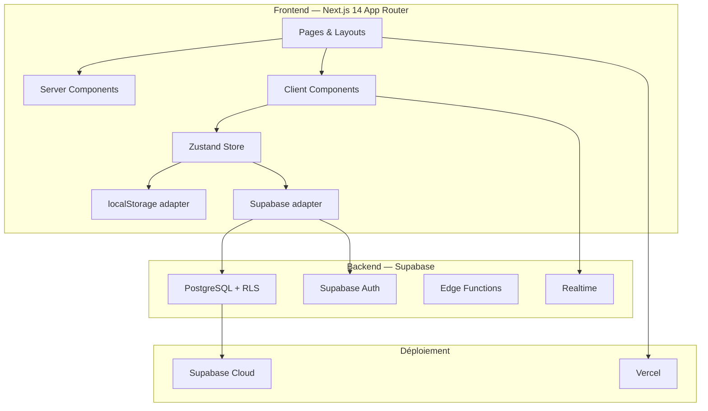
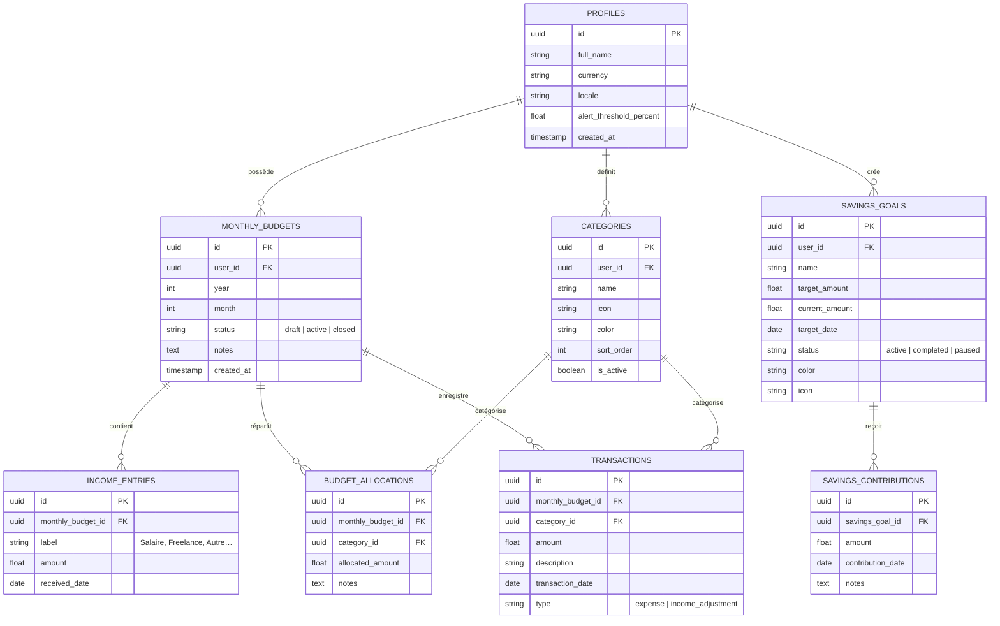

# MonBudget — Plan d'Implémentation Complet

SaaS de gestion de salaire et de budget personnel pour les particuliers.  
**Stack** : Next.js 14 (App Router) · Supabase (PostgreSQL + Auth) · Tailwind CSS · Vercel  
**Flux** : Design → Données locales → BDD → Auth → Déploiement

---

## Philosophie Architecturale

> **Budget = document mensuel entièrement libre.**  
> Chaque mois est une feuille blanche : l'utilisateur décide combien il alloue à chaque catégorie. Aucune règle de répartition automatique n'est imposée. Il peut dupliquer un mois précédent comme point de départ, mais reste libre de tout modifier.

---

## User Review Required

> [!IMPORTANT]
> **Devise et localisation** — Le plan suppose l'Euro (€) comme devise par défaut avec possibilité de changer dans le profil. Confirmez si vous souhaitez un support multi-devises dès le départ ou seulement FCFA/Euro.

> [!IMPORTANT]
> **Modèle économique** — Le plan prévoit un mode gratuit complet (freemium). Souhaitez-vous intégrer un plan payant (Stripe) dès la v1, ou le reporter à une phase ultérieure ?

> [!IMPORTANT]
> **Notifications** — Les alertes de dépassement seront affichées in-app (toasts + badge). Souhaitez-vous aussi des notifications par email ou push dès la v1 ?

---

## Open Questions

1. **Catégories par défaut** — Voulez-vous un jeu de catégories prédéfinies (Loyer, Nourriture, Transport, Loisirs, Santé, Épargne…) que l'utilisateur peut modifier/supprimer, ou un démarrage totalement vierge ?
2. **Multi-sources de revenus** — L'utilisateur peut-il saisir plusieurs sources de revenus par mois (salaire + freelance + autre) ou un seul champ "salaire" suffit ?
3. **Partage familial** — Un budget peut-il être partagé entre conjoints/famille, ou c'est strictement individuel pour la v1 ?

---

## Architecture Globale



---

## Structure du Projet

```
MonBudget/
├── src/
│   ├── app/                          # Next.js App Router
│   │   ├── (auth)/                   # Routes publiques (login, register)
│   │   │   ├── login/page.tsx
│   │   │   ├── register/page.tsx
│   │   │   └── layout.tsx
│   │   ├── (dashboard)/              # Routes protégées
│   │   │   ├── layout.tsx            # Sidebar + Header
│   │   │   ├── page.tsx              # Dashboard principal
│   │   │   ├── budget/
│   │   │   │   ├── page.tsx          # Vue mensuelle du budget
│   │   │   │   └── [monthId]/page.tsx
│   │   │   ├── transactions/
│   │   │   │   └── page.tsx          # Liste des dépenses
│   │   │   ├── savings/
│   │   │   │   └── page.tsx          # Objectifs d'épargne
│   │   │   ├── reports/
│   │   │   │   └── page.tsx          # Rapports & tendances
│   │   │   └── settings/
│   │   │       └── page.tsx          # Profil & préférences
│   │   ├── layout.tsx                # Root layout
│   │   └── globals.css
│   ├── components/
│   │   ├── ui/                       # Composants atomiques (Button, Input, Card, Modal…)
│   │   ├── dashboard/                # Widgets du tableau de bord
│   │   ├── budget/                   # Composants budget (BudgetEditor, CategoryRow…)
│   │   ├── transactions/             # Formulaire & liste de transactions
│   │   ├── savings/                  # Composants objectifs d'épargne
│   │   ├── charts/                   # Graphiques (Recharts)
│   │   └── layout/                   # Sidebar, Header, MobileNav
│   ├── lib/
│   │   ├── supabase/
│   │   │   ├── client.ts             # Client navigateur
│   │   │   ├── server.ts             # Client serveur (RSC)
│   │   │   ├── middleware.ts         # Auth middleware
│   │   │   └── types.ts             # Types générés depuis la DB
│   │   ├── store/
│   │   │   ├── budget-store.ts       # Zustand store — budgets
│   │   │   ├── transaction-store.ts  # Zustand store — transactions
│   │   │   ├── savings-store.ts      # Zustand store — épargne
│   │   │   └── adapters/
│   │   │       ├── local-adapter.ts  # Persistance localStorage
│   │   │       └── supabase-adapter.ts # Persistance Supabase
│   │   ├── utils/
│   │   │   ├── currency.ts           # Formatage monétaire
│   │   │   ├── dates.ts             # Helpers mois/année
│   │   │   ├── budget-calc.ts       # Calculs budget (reste, %, alertes)
│   │   │   └── cn.ts                # Utility classnames (clsx + twMerge)
│   │   └── constants.ts             # Catégories par défaut, seuils d'alerte
│   ├── hooks/
│   │   ├── use-budget.ts
│   │   ├── use-transactions.ts
│   │   ├── use-savings.ts
│   │   └── use-alerts.ts
│   └── types/
│       └── index.ts                  # Types TypeScript globaux
├── supabase/
│   ├── migrations/                   # Migrations SQL
│   └── seed.sql                      # Données de seed
├── public/
│   └── icons/                        # Icônes catégories
├── tailwind.config.ts
├── next.config.js
├── middleware.ts                      # Auth guard Supabase
├── package.json
└── .env.local
```

---

## Modèle de Données

### Schéma conceptuel



### Points clés du modèle

| Décision | Justification |
|----------|---------------|
| `MONTHLY_BUDGETS` = document mensuel | Chaque mois est indépendant. Pas de template imposé. |
| `BUDGET_ALLOCATIONS` séparées | L'utilisateur alloue librement par catégorie par mois. |
| `INCOME_ENTRIES` multiples par mois | Supporte salaire + revenus complémentaires. |
| `CATEGORIES` par utilisateur | Chacun personnalise ses catégories. |
| `status` sur `MONTHLY_BUDGETS` | Permet de distinguer brouillon / actif / clôturé. |
| `SAVINGS_CONTRIBUTIONS` séparées | Historique détaillé des versements vers chaque objectif. |

---

## Proposed Changes — Phases d'Implémentation

### Phase 1 — Fondation & Design System (Jours 1-2)

#### [NEW] Initialisation du projet Next.js 14

```bash
npx -y create-next-app@latest ./ --typescript --tailwind --eslint --app --src-dir --import-alias "@/*" --no-turbo
```

Dépendances additionnelles :
```bash
npm install zustand recharts lucide-react clsx tailwind-merge
npm install @supabase/supabase-js @supabase/ssr
npm install -D supabase
```

#### [NEW] Design System & Composants UI

| Fichier | Description |
|---------|-------------|
| `src/app/globals.css` | Variables CSS custom (couleurs, ombres, rayons), thème sombre/clair |
| `src/lib/utils/cn.ts` | Utility `cn()` = clsx + tailwind-merge |
| `src/components/ui/button.tsx` | Bouton avec variantes (primary, secondary, ghost, danger) |
| `src/components/ui/input.tsx` | Input avec label, erreur, icône |
| `src/components/ui/card.tsx` | Carte glassmorphism avec ombres subtiles |
| `src/components/ui/modal.tsx` | Modal avec overlay et animations |
| `src/components/ui/badge.tsx` | Badge pour statuts et alertes |
| `src/components/ui/progress-bar.tsx` | Barre de progression animée (budget, épargne) |
| `src/components/ui/toast.tsx` | Notifications toast (succès, alerte, erreur) |
| `src/components/ui/dropdown.tsx` | Menu déroulant pour sélections |
| `src/components/ui/month-picker.tsx` | Sélecteur de mois/année |

#### [NEW] Layout principal

| Fichier | Description |
|---------|-------------|
| `src/components/layout/sidebar.tsx` | Sidebar avec navigation, logo, liens actifs, collapse mobile |
| `src/components/layout/header.tsx` | Header avec sélecteur de mois, recherche, avatar |
| `src/components/layout/mobile-nav.tsx` | Navigation bottom-bar mobile |
| `src/app/(dashboard)/layout.tsx` | Layout protégé avec sidebar + header |

**Palette & Design** :
- **Primaire** : Bleu profond `#1E3A5F` → gradient vers `#3B82F6`
- **Accent** : Vert succès `#10B981`, Orange alerte `#F59E0B`, Rouge danger `#EF4444`
- **Fond** : Dark mode `#0F172A` / Light mode `#F8FAFC`
- **Glassmorphism** : `backdrop-blur-xl bg-white/5 border border-white/10`
- **Typographie** : Inter (Google Fonts)
- **Animations** : Transitions douces 200-300ms, micro-interactions sur hover

---

### Phase 2 — Pages & Données Locales (Jours 3-5)

#### [NEW] Types TypeScript

##### `src/types/index.ts`
Définition de toutes les interfaces : `Profile`, `Category`, `MonthlyBudget`, `IncomeEntry`, `BudgetAllocation`, `Transaction`, `SavingsGoal`, `SavingsContribution`.

#### [NEW] Stores Zustand avec localStorage

##### `src/lib/store/budget-store.ts`
- State : `budgets`, `currentMonth`, `categories`
- Actions : `createMonth()`, `duplicateMonth()`, `addIncome()`, `setAllocation()`, `closeMonth()`
- Persistance automatique dans `localStorage`

##### `src/lib/store/transaction-store.ts`
- State : `transactions`
- Actions : `addTransaction()`, `editTransaction()`, `deleteTransaction()`, `getByMonth()`, `getByCategory()`

##### `src/lib/store/savings-store.ts`
- State : `goals`, `contributions`
- Actions : `createGoal()`, `addContribution()`, `pauseGoal()`, `completeGoal()`

#### [NEW] Utilitaires de calcul

##### `src/lib/utils/budget-calc.ts`
```typescript
// Fonctions clés :
getTotalIncome(budget)           // Somme des revenus du mois
getTotalAllocated(budget)        // Somme des allocations
getRemainingToAllocate(budget)   // Revenu - Alloué
getSpentByCategory(transactions) // Dépensé par catégorie
getCategoryProgress(allocated, spent) // % utilisé
getOverBudgetCategories(budget, transactions) // Catégories en dépassement
getMonthSummary(budget, transactions) // Résumé complet du mois
```

#### [NEW] Pages principales

##### Dashboard — `src/app/(dashboard)/page.tsx`
- **Widget Résumé du mois** : Revenu total, Dépensé, Restant (grande carte avec gradient)
- **Widget Répartition** : Donut chart des dépenses par catégorie (Recharts)
- **Widget Alertes** : Liste des catégories proches/en dépassement
- **Widget Dernières transactions** : 5 dernières transactions
- **Widget Objectifs d'épargne** : Barres de progression des objectifs actifs
- **Widget Tendance** : Line chart comparaison mois précédents

##### Budget mensuel — `src/app/(dashboard)/budget/page.tsx`
- **Sélecteur de mois** en haut
- **Section Revenus** : Liste des entrées de revenus avec ajout/suppression
- **Section Allocations** : Grille de catégories avec montants éditables inline
- **Barre de résumé** : Total alloué / Total revenu / Reste à allouer (progress bar)
- **Bouton "Dupliquer le mois précédent"** : Copie les allocations du mois N-1
- **Indicateurs visuels** : Vert si sous-budget, orange si > 80%, rouge si dépassé

##### Transactions — `src/app/(dashboard)/transactions/page.tsx`
- **Formulaire d'ajout rapide** : Montant, catégorie, description, date
- **Liste filtrée** : Par mois, par catégorie, recherche texte
- **Tri** : Par date, montant, catégorie
- **Actions** : Modifier, supprimer avec confirmation

##### Épargne — `src/app/(dashboard)/savings/page.tsx`
- **Cartes d'objectifs** : Nom, cible, progression, date limite
- **Formulaire d'ajout** : Nouvel objectif avec couleur et icône
- **Historique des contributions** par objectif
- **Actions** : Ajouter contribution, pause, marquer comme atteint

##### Rapports — `src/app/(dashboard)/reports/page.tsx`
- **Comparaison mensuelle** : Bar chart revenus vs dépenses sur 6-12 mois
- **Évolution par catégorie** : Line chart d'une catégorie dans le temps
- **Top catégories** : Classement des postes de dépense
- **Taux d'épargne** : % épargné par mois

##### Paramètres — `src/app/(dashboard)/settings/page.tsx`
- **Profil** : Nom, devise, seuil d'alerte (%)
- **Catégories** : CRUD complet, réordonnancement drag & drop, icônes, couleurs
- **Données** : Export CSV, reset des données

#### [NEW] Système d'alertes

##### `src/hooks/use-alerts.ts`
- Calcul en temps réel des dépassements
- Seuil configurable (par défaut 80%)
- 3 niveaux : info (> 50%), warning (> seuil), danger (> 100%)
- Affichage via toasts et badges dans la sidebar

---

### Phase 3 — Base de Données Supabase (Jours 6-7)

#### [NEW] Migrations SQL

##### `supabase/migrations/001_initial_schema.sql`
- Création de toutes les tables selon le schéma ER ci-dessus
- Index sur `(user_id, year, month)` pour les budgets
- Index sur `(monthly_budget_id, category_id)` pour les transactions
- Contrainte unique `(user_id, year, month)` sur `monthly_budgets`

##### `supabase/migrations/002_rls_policies.sql`
- **Row Level Security** activée sur toutes les tables
- Politique : chaque utilisateur ne voit/modifie **que ses propres données**
- Exemple : `auth.uid() = user_id`

##### `supabase/migrations/003_functions.sql`
- `get_month_summary(user_id, year, month)` — Vue agrégée d'un mois
- `duplicate_month(user_id, source_year, source_month, target_year, target_month)` — Duplication des allocations

#### [MODIFY] Adapter Supabase dans les stores

##### `src/lib/store/adapters/supabase-adapter.ts`
- Remplacement transparent de localStorage par les appels Supabase
- Les stores Zustand utilisent un adapter pattern :
  - Mode non-connecté → `local-adapter.ts` (localStorage)
  - Mode connecté → `supabase-adapter.ts` (Supabase)
- **Migration des données** : À la première connexion, les données locales sont poussées vers Supabase

#### [NEW] Client Supabase

##### `src/lib/supabase/client.ts`
Client navigateur avec `createBrowserClient()`

##### `src/lib/supabase/server.ts`
Client serveur avec `createServerClient()` pour les RSC

##### `src/lib/supabase/middleware.ts`
Rafraîchissement automatique du token dans le middleware Next.js

---

### Phase 4 — Authentification (Jour 8)

#### [NEW] Pages d'authentification

##### `src/app/(auth)/login/page.tsx`
- Email + mot de passe
- Lien vers inscription
- Design premium avec gradient de fond et carte centrée

##### `src/app/(auth)/register/page.tsx`
- Nom, email, mot de passe
- Création automatique du profil + catégories par défaut
- Redirection vers le dashboard

##### `src/app/(auth)/layout.tsx`
Layout minimaliste pour les pages auth (sans sidebar)

#### [NEW] Middleware d'authentification

##### `middleware.ts`
- Protège toutes les routes `/(dashboard)/*`
- Redirige vers `/login` si non authentifié
- Rafraîchit la session Supabase

#### [MODIFY] Profil utilisateur

##### `src/app/(dashboard)/settings/page.tsx`
- Ajout de la section compte : changer mot de passe, déconnexion
- Liaison du profil Supabase avec les préférences locales

---

### Phase 5 — Polish & Déploiement (Jours 9-10)

#### Optimisations

| Aspect | Action |
|--------|--------|
| **Performance** | Lazy loading des pages, optimistic updates sur les mutations |
| **SEO** | Metadata Next.js sur chaque page, `robots.txt`, `sitemap.xml` |
| **Responsive** | Test et ajustement mobile-first sur toutes les pages |
| **Accessibilité** | Labels ARIA, navigation clavier, contrastes suffisants |
| **Error handling** | Error boundaries, états vides/loading/error sur chaque page |
| **PWA** | `manifest.json` pour installation sur mobile |

#### [NEW] Configuration Vercel

##### `vercel.json`
- Variables d'environnement : `NEXT_PUBLIC_SUPABASE_URL`, `NEXT_PUBLIC_SUPABASE_ANON_KEY`
- Redirections et rewrites si nécessaire

#### [NEW] Landing page

##### `src/app/page.tsx` (racine)
- Hero section avec CTA "Commencer gratuitement"
- 3 features highlights avec icônes
- Section "Comment ça marche" en 3 étapes
- Footer avec liens

---

## Résumé des Écrans

| # | Écran | Description | Priorité |
|---|-------|-------------|----------|
| 1 | Landing Page | Page d'accueil marketing | P1 |
| 2 | Login / Register | Authentification | P1 |
| 3 | Dashboard | Vue d'ensemble du mois | P1 |
| 4 | Budget Mensuel | Revenus + Allocations par catégorie | P1 |
| 5 | Transactions | Saisie et suivi des dépenses | P1 |
| 6 | Épargne | Objectifs et contributions | P2 |
| 7 | Rapports | Graphiques et tendances | P2 |
| 8 | Paramètres | Profil, catégories, préférences | P1 |

---

## Verification Plan

### Automated Tests
```bash
# Lint & Type check
npm run lint
npx tsc --noEmit

# Build de production
npm run build

# Tests unitaires sur les calculs budget
npx jest src/lib/utils/budget-calc.test.ts
```

### Manual Verification
- Navigation complète entre toutes les pages
- Création d'un budget mensuel complet (revenus → allocations → transactions)
- Duplication d'un mois précédent
- Alertes de dépassement visibles quand une catégorie dépasse le seuil
- Persistance des données après rechargement (localStorage puis Supabase)
- Responsive : test sur mobile (375px), tablette (768px), desktop (1440px)
- Inscription, connexion, déconnexion
- Déploiement Vercel fonctionnel
